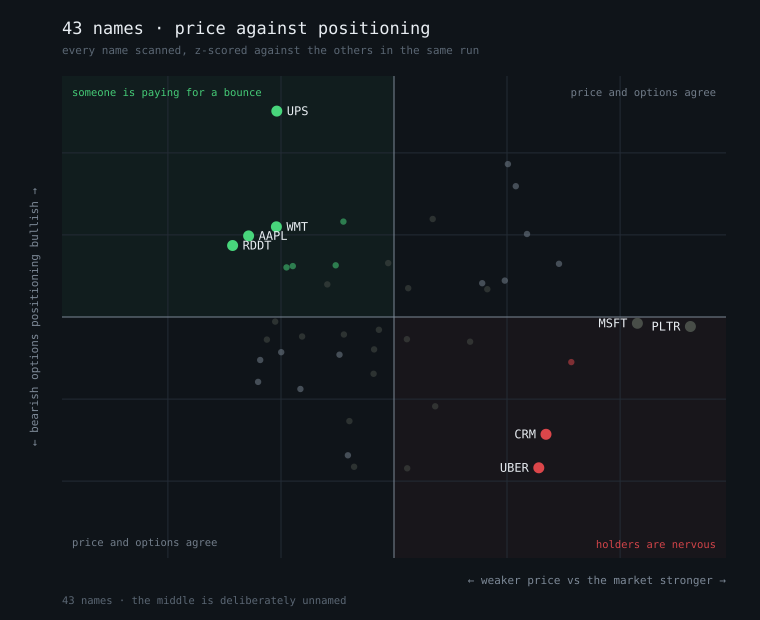

# tradesights

**Talk is cheap. Options cost money.** This tool ranks the stocks where those
two stop agreeing.

Every morning it looks at the same three things for every name it covers — what
the price did, what the options market is being paid to believe, and what people
are saying — and puts the biggest disagreements at the top of one list. When all
three agree there is nothing here: the move happened, the crowd noticed, the
positioning confirms it, and you are reading the news. The interesting names are
the ones that rallied while somebody quietly bought protection, or that everyone
is shouting about while no options desk will fund the trade.

It is a screener. It tells you where to look and it does not tell you what to do.

## Why these three layers

**Price is what already happened.** It is a fact, it is free, and by the time a
chart looks obvious it is in the price.

**Options are what somebody paid to be right about.** A trader who is long a
stock and quietly buying puts against it is telling you something they would not
post. That is the signal worth the most, because it cost the person sending it
something.

**Talk is what people say will happen** — free to produce, which is the whole
problem with it. It counts here at half weight, never more, because a loud
enough crowd should not be able to outvote the people actually paying.

Macro is not a fourth signal. It is the weather: a rate-sensitive divergence
reads differently at a 4.7% ten-year than at 2%, so the regime is shown at the
top of the report and used to sort what matters, not scored per name.

## The four situations

Crossing price against positioning puts every name in one of four boxes. The
names are borrowed from [the video that prompted this](#credit) and kept because
they describe what a person is *doing* rather than what the greeks say:

| | price down | price up |
| :--- | :--- | :--- |
| **calls bid** | **Contrarian Bid** — someone is paying for a bounce | **Chase** — trend confirmed, and crowded |
| **puts bid** | **Fear** — the market believes the drop | **Hedged Rally** — holders are nervous |

Adding the talk layer gives two more that price and options alone cannot see:

- **Hype without money** — loud and bullish, with no positioning behind it.
- **Money without hype** — positioning hard, and nobody is discussing it.

## The one chart

The ranked list says what to look at. It cannot say whether today is *unusual* —
five names above a divergence of 2 is either a market coming apart or an
ordinary Tuesday, and the top of a table looks identical either way.

```bash
tradesights chart -o quadrants.svg
```

plots every scanned name, price against positioning, both z-scored against each
other. A calm morning is a cloud around the origin; a morning where the options
market has stopped agreeing with price grows two diagonal wings. Standalone SVG,
no plotting library, nothing to install.



Only the two *disagreement* quadrants are shaded, because a name whose price and
options point the same way is the normal case and giving it equal visual weight
would give equal weight to the boring half of the market. Deliberately not
drawn: a time series of divergence (it would need history this tool does not
keep, and drawing it from one snapshot means fabricating the past), sector
heatmaps (eleven coloured squares saying "tech is up", presented as analysis),
and anything with a price chart on it — the whole premise is that the price
chart is the layer everyone already has.

## The archive, and the only question that matters

Without memory this tool produces an opinion every morning and forgets it by
lunch. That is enough to decide what to look at. It is not enough to decide
whether looking there was ever worth it — because the useful question is not
*which names are stretched today* but **when a name looked like this before,
what happened next?**, and answering it needs yesterday.

```bash
tradesights snapshot         # write today's scan down
tradesights sessions         # what is in the archive
tradesights resolve          # did the disagreements go anywhere
```

A snapshot stores the z-scores, the quadrant, the divergence and — the field
that makes the rest useful — the close each reading was measured against. A
snapshot without a price records only that a name looked interesting, never
whether it then went anywhere.

`resolve` groups resolved observations by quadrant and reports an **edge**
column: that quadrant's mean forward return minus everything else's over the
same sessions. Read that column and not the mean. In a rising market every
quadrant looks predictive, and subtracting the market is the only way to tell a
signal from a tide.

Three things it is not, and each is load-bearing:

**Not a backtest.** It cannot be. The archive starts the day it is switched on
and accumulates forward in real time. Nothing reconstructs history from current
data — that would be a backtest of a screener against its own inputs, which is a
machine for confirming whatever you already believe.

**Not a performance record.** A forward return after a signal is not a trade.
There is no entry rule, no stop, no size and no cost, and the difference between
"names in this quadrant drifted up 1.2% over five days" and "this made money" is
every part of trading that is hard.

**Not going to say anything for months.** Thirty sessions is six trading weeks,
and every name on the same day shares a market — so the effective sample grows
far more slowly than the row count suggests. `resolve` says so itself rather
than printing a confident percentage.

Put it on a timer; see [`deploy/`](deploy/). A session missed is a session that
can never be recovered, since option chains are not retrievable after the fact.

## The dashboard

```bash
tradesights dashboard        # http://127.0.0.1:8095
```

Loopback, unauthenticated, and structurally unable to place an order. It reads
the archive rather than the market: a live scan pulls 43 option chains and takes
minutes, which is not a thing to do inside an HTTP request. An empty archive
shows as an empty archive with the command to fix it, rather than as a broken
page.

Four views:

- **The map** — every scanned name on one plot, price against positioning. Click
  a dot for that name's three layers and its divergence across stored sessions,
  which answers the thing a single scan structurally cannot: has this been
  stretched for a fortnight, or did it arrive this morning?
- **Ranked** — the sortable table, filterable by quadrant.
- **Did it go anywhere** — the resolution scores, with the reasons not to
  believe them printed above the numbers.
- **Archive** — what has been recorded, and a way to load any past session.

## Site


<https://clanker-labs.github.io/tradesights/> — with a demo built entirely from
a real scan.

## What it is not

**Not a prediction.** Every name it surfaces is a question. The list is ranked by
how far the layers disagree, which is a measure of how *interesting* a name is,
not of which way it goes.

**Not a trading system.** There is no order execution in this repo and no path
from it to a broker, deliberately and permanently. It reads and it reports.

**Not backtested, and carrying no performance claims.** Somebody else's six
months of trades is not evidence a method works, and this README is not going to
tell you a number to make the idea sound better than it is.

## Sharp edges

- **Option chains come from Yahoo via `yfinance`, which is scraped rather than
  licensed.** It breaks without warning and has no support contract. The tool
  reports a missing chain as missing rather than guessing around it, but a
  morning where Yahoo is unhappy is a morning with a shorter list.
- **Implied-volatility skew is a crude proxy for positioning.** It cannot see
  who is on which side of a trade, or whether a put was bought as a hedge or
  sold for income. It is directionally useful and it is not order flow.
- **The X layer needs credits.** Without them the talk layer is absent, and
  absent is scored as absent — never as neutral. A name nobody discussed and a
  name nobody checked are different facts, and treating them the same would
  invent divergence that is not there.
- **Thin names produce nonsense.** A stock with four option contracts and no
  volume will happily generate a dramatic skew. There is a liquidity floor and
  names below it are dropped rather than ranked.

## Credit

The core idea — pull price and options positioning for every name, and pay
attention where they disagree — is from
[@berttrading](https://www.instagram.com/reel/DcRZLiegCdz/), including the four
quadrant names. The social layer, the macro regime, the plain-English digest and
everything in this repo are ours.

## Licence

MIT.
